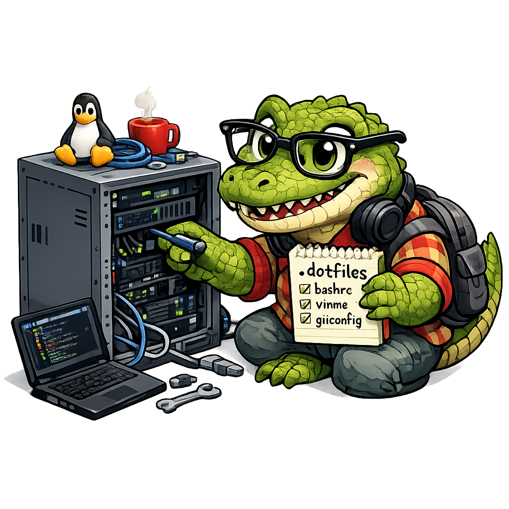

<h1 align="center">
    
    <br/>
    <sub>sdots</sub>
</h1>
<p align="center">
    
    
    
    
</p>

dotfiles for Ubuntu Server managed with GNU Stow and mise.

## What it sets up

- **Shell**: Zsh with starship prompt, fzf, eza, zoxide, tmux, bat, ripgrep, fd, jq, curlie
- **Editors**: Neovim
- **Agents**: opencode, claude-code
- **Dev tools**: mise, Docker, Docker Compose, nginx, GitHub CLI (`gh`), lazygit, lazydocker, atuin, btop, yazi, Sesh
- **Languages**: Node.js (LTS), Python (latest), Go (latest)

Core system packages (Docker, Docker Compose, nginx, build-essential, git, curl, stow) are installed through apt. The rest is installed through mise after the OS packages are in place.

## Install

```bash
curl -fsSL https://raw.githubusercontent.com/mrpbennett/sdots/main/install.sh | bash
```

Log out and back in after installation before using Docker without `sudo`.

## Stow maintenance

All symlinks are managed with `--no-folding` so stow creates real directories and only symlinks individual files. This prevents conflicts when multiple tools share a parent like `~/.config/`.

| Command                                                                 | Purpose                                                             |
| ----------------------------------------------------------------------- | ------------------------------------------------------------------- |
| `stow --no-folding --restow --dir "$DOTFILES_DIR" --target "$HOME" .`   | Relink everything (safe to re-run after adding/removing files)      |
| `stow --no-folding --simulate --dir "$DOTFILES_DIR" --target "$HOME" .` | Dry run — preview what would change without touching the filesystem |
| `stow --delete --dir "$DOTFILES_DIR" --target "$HOME" .`                | Remove all managed symlinks (leaves real files untouched)           |

`$DOTFILES_DIR` is wherever you cloned the repo — typically `~/.local/share/sdots`.

## Tmux keybindings

<summary>All custom keybindings — prefix is <code>Ctrl+Space</code> or <code>Ctrl+s</code></summary>

### Config

| Key          | Action                       |
| ------------ | ---------------------------- |
| `prefix + q` | Reload config                |
| `prefix + ?` | Show all keybindings (popup) |

### Pane splits

| Key                   | Action                        |
| --------------------- | ----------------------------- |
| `prefix + \|`         | Split right                   |
| `prefix + -`          | Split down                    |
| `prefix + h`          | Split right (vim-style)       |
| `prefix + v`          | Split down (vim-style)        |
| `prefix + x`          | Kill pane                     |
| `prefix + f`          | Floating shell popup (80×60%) |
| `Alt + Enter`         | Split right (no prefix)       |
| `Alt + Shift + Enter` | Split down (no prefix)        |
| `Alt + Escape`        | Kill pane (no prefix)         |

### Pane navigation

| Key                    | Action                          |
| ---------------------- | ------------------------------- |
| `prefix + h/j/k/l`     | Navigate panes (vim-style)      |
| `Ctrl + Alt + ←/→/↑/↓` | Navigate panes (arrows)         |
| `Ctrl + Alt + h/j/k/l` | Navigate panes (vim, no prefix) |

### Pane resize

| Key                            | Action                          |
| ------------------------------ | ------------------------------- |
| `prefix + H/J/K/L`             | Resize pane 5 cells             |
| `Ctrl + Alt + Shift + ←/→/↑/↓` | Resize pane 5 cells (no prefix) |

### Windows

| Key          | Action        |
| ------------ | ------------- |
| `prefix + c` | New window    |
| `prefix + r` | Rename window |
| `prefix + k` | Kill window   |

### Window navigation

| Key               | Action                        |
| ----------------- | ----------------------------- |
| `Alt + 1–9`       | Switch to window (no prefix)  |
| `Alt + ←`         | Previous window (no prefix)   |
| `Alt + →`         | Next window (no prefix)       |
| `Alt + Shift + ←` | Move window left (no prefix)  |
| `Alt + Shift + →` | Move window right (no prefix) |

### Sessions

| Key          | Action                          |
| ------------ | ------------------------------- |
| `prefix + C` | New session                     |
| `prefix + R` | Rename session                  |
| `prefix + K` | Kill session                    |
| `prefix + P` | Previous session                |
| `prefix + N` | Next session                    |
| `prefix + T` | Sesh session picker (fzf popup) |

### Copy mode (vi)

| Key          | Action                  |
| ------------ | ----------------------- |
| `prefix + [` | Enter copy mode         |
| `v`          | Begin selection         |
| `y`          | Copy selection and exit |
